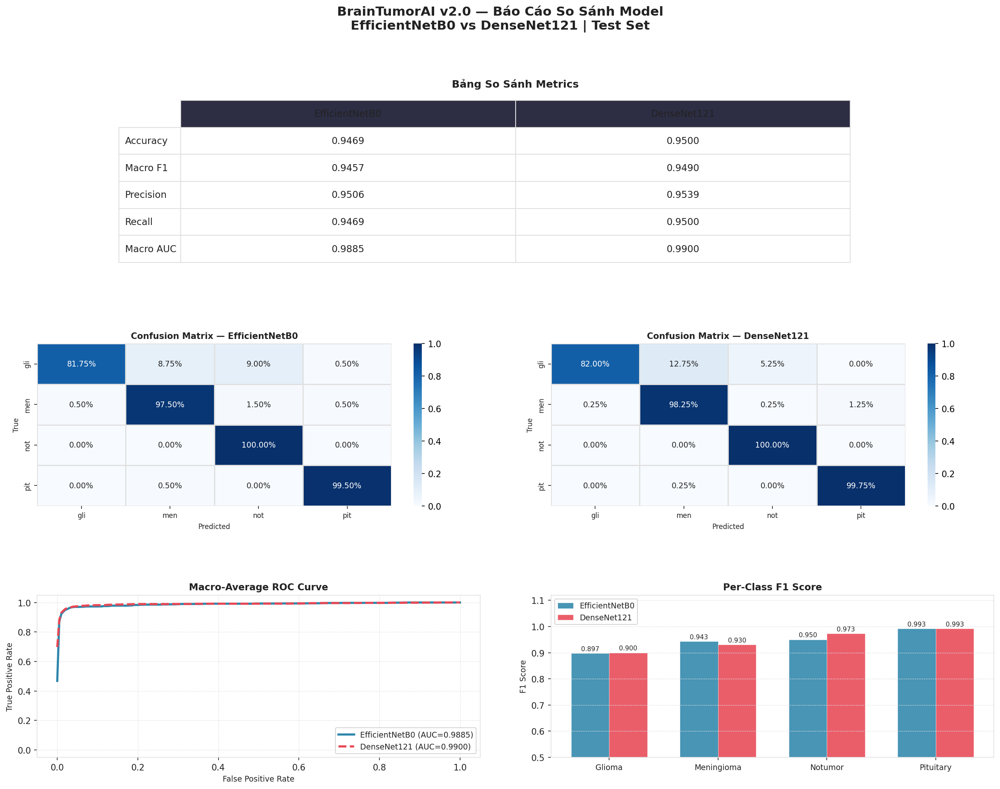
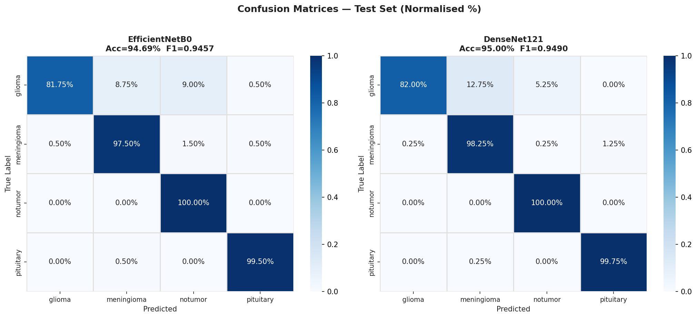
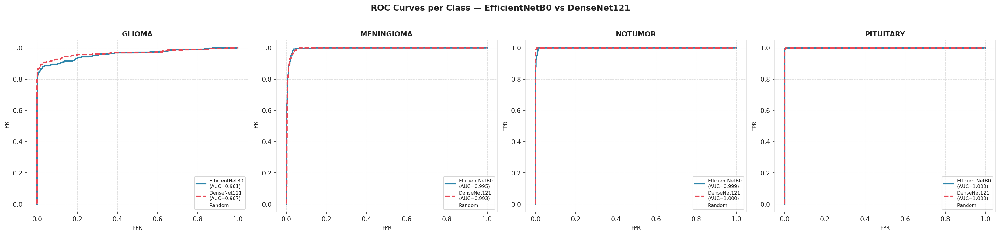
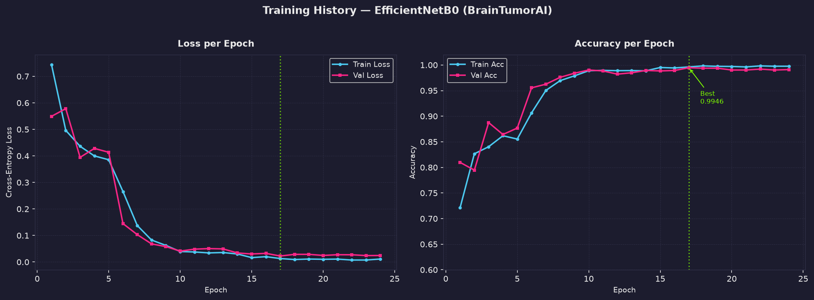

# BrainTumorAI v2.1 (Anti-Domain-Shift & High-Generalization Edition)

**Hệ thống phân loại khối u não trên ảnh MRI toàn diện sử dụng PyTorch (EfficientNetB0 / DenseNet121), Explainable AI (Grad-CAM), Test-Time Augmentation (TTA), FastAPI và Next.js**


---

## 📌 Tiến độ & Cải tiến nổi bật (Phiên bản v2.1)

Sau khi kiểm thử thực tế với hình ảnh MRI bên ngoài (Out-of-Distribution / External Data), hệ thống đã được phân tích chuyên sâu và nâng cấp toàn bộ pipeline để **khắc phục hiện tượng Domain Shift (lệch phân phối dữ liệu)** và chống suy giảm hiệu năng khi dự đoán ảnh ngoài tập dữ liệu mẫu:

1. **Phân tích Overfitting & Domain Shift**:
   - Khoảng cách giữa Train Acc (99.69%) và Validation Acc (99.29%) chỉ là **0.40%** (Val Loss không tăng), khẳng định mô hình **không bị overfitting thuần túy** trên tập nội bộ.
   - Nguyên nhân dự đoán sai ảnh bên ngoài là do **Domain Shift** (khác biệt thiết bị MRI, độ phân giải, độ sáng/tương phản giữa các cơ sở y tế).
2. **Nâng cấp Data Augmentation (Giai đoạn 1)**:
   - Thêm `GaussianBlur` (30% xác suất) mô phỏng ảnh MRI độ phân giải thấp.
   - Thêm `RandomGrayscale` (10% xác suất) và `RandomPerspective` (20% xác suất, distortion=0.1) mô phỏng khác biệt thiết bị và góc chụp.
   - Mở rộng góc xoay (`RandomRotation` 20° → 30°), độ sáng/tương phản (`ColorJitter` 0.2 → 0.3), zoom (`RandomAffine` scale 0.85–1.15) và tỉ lệ che đen (`RandomErasing` 10% → 20%).
3. **Tăng cường Chống Học Vẹt (Giai đoạn 2)**:
   - Thêm **Classifier Head Dropout (`p=0.3`)** trước lớp Linear của EfficientNetB0 và DenseNet121.
   - Tích hợp **Label Smoothing (`label_smoothing=0.1`)** trong `CrossEntropyLoss` giúp giảm overconfidence (sự tự tin thái quá của model khi gặp ảnh lạ).
   - Tăng penalty `weight_decay` từ `1e-4` lên `1e-3`.
4. **Test-Time Augmentation - TTA (Giai đoạn 3)**:
   - Tích hợp phương thức `predict_with_tta()` chạy **5 biến thể ảnh** (Gốc, Lật ngang, Xoay ±10°, Brightness/Contrast nhẹ, Zoom nhẹ) và tính trung bình xác suất (Mean Ensemble) trước khi đưa ra kết quả cuối cùng.

---

## 🩺 Giới thiệu dự án

Dự án **BrainTumorAI** là một hệ thống phân loại ảnh MRI não thành **4 lớp**, đi kèm với bản đồ giải thích (Heatmap) giúp bác sĩ/người dùng hiểu được quyết định của AI.

| Lớp | Mô tả | Số lượng Train | Số lượng Test |
|---|---|---|---|
| **Glioma** | U thần kinh đệm — phát sinh từ tế bào thần kinh đệm | 1,400 | 400 |
| **Meningioma** | U màng não — thường lành tính, phát triển chậm | 1,400 | 400 |
| **Pituitary** | U tuyến yên — có thể gây rối loạn hormone | 1,400 | 400 |
| **No Tumor** | Não bình thường — lớp đối chứng âm tính | 1,400 | 400 |
| **Tổng cộng** | **Cân bằng 4 lớp** | **5,600** | **1,600** |

---

## 📁 Cấu trúc dự án

```text
BrainTumorAI/
├── app/
│   ├── frontend/         # Next.js Web App (React 19, Tailwind CSS v4)
│   └── backend/          # FastAPI REST API (Inference TTA & Grad-CAM)
├── data/
│   ├── Training/         # 5,600 ảnh huấn luyện (4 thư mục lớp)
│   └── Testing/          # 1,600 ảnh kiểm thử độc lập
├── docs/                 # Tài liệu hướng dẫn chạy dự án
├── models/               # Nơi lưu checkpoint (.pth, .onnx)
├── notebooks/            # Jupyter notebooks (EDA & Đánh giá mô hình)
├── reports/              # Nơi lưu JSON metrics và Figures (biểu đồ)
├── src/
│   ├── config.py         # Cấu hình tập trung toàn bộ dự án (AugConfig, TrainConfig)
│   ├── utils.py          # Helper functions (seed, paths)
│   ├── preprocessing/    # Xử lý dữ liệu, augmentation pipeline & TTA transforms
│   ├── training/         # Cấu trúc huấn luyện 2-phase, EarlyStopping, Loss function
│   ├── inference/        # Lớp TumorPredictor hỗ trợ Single & TTA Inference
│   └── explainability/   # Tích hợp Grad-CAM tự động phát hiện target layer
├── tests/                # Bộ kiểm thử tự động (Pytest)
├── .env.example          # Mẫu biến môi trường
├── docker-compose.yml    # Docker config
├── pytest.ini            # Cấu hình Pytest
├── requirements.txt      # Python dependencies
└── README.md             # Tài liệu này
```

---

## ⚡ Bắt đầu nhanh

### 1. Cài đặt Backend (FastAPI & PyTorch)

Yêu cầu: Python 3.9+

```bash
# Tạo và kích hoạt môi trường ảo
python -m venv venv
# Windows: venv\Scripts\activate | Mac/Linux: source venv/bin/activate

# Cài đặt thư viện
pip install -r requirements.txt
```

### 2. Cài đặt Frontend (Next.js)

Yêu cầu: Node.js 18+

```bash
cd app/frontend
npm install
```

### 3. Huấn luyện mô hình (Training v2.1)

Mô hình được tối ưu qua quy trình **2-Phase Fine-Tuning** kết hợp **Regularization nâng cao**:

- **Phase 1**: Đóng băng backbone, chỉ train classifier head với Dropout `p=0.3` (5 epochs, LR=1e-3).
- **Phase 2**: Mở băng toàn bộ mạng (Unfreeze all), fine-tune với Label Smoothing `0.1` và Weight Decay `1e-3` (35 epochs max, LR=1e-4).

```bash
# Train bằng EfficientNetB0 (Mô hình chính)
python -m src.training.train --model-name efficientnet

# Train bằng DenseNet121 (Mô hình đối chiếu)
python -m src.training.train --model-name densenet
```

### 4. Khởi chạy Hệ thống (Web & API)

Mở 2 Terminal riêng biệt:

**Terminal 1 — Backend (FastAPI)**
```bash
uvicorn app.backend.main:app --reload --host 127.0.0.1 --port 8000
```

**Terminal 2 — Frontend (Next.js)**
```bash
cd app/frontend
npm run dev
```

### 5. Khởi chạy bằng Docker

```bash
docker-compose up -d --build
```
Hệ thống web sẽ chạy tại `http://localhost:3000`.

---

## 🔄 Pipeline Machine Learning & Inference

```text
data/Training/ (5,600 ảnh)
    │
    ↓ [Stratified Split] 80% Train / 20% Val · Class Weighting
    ↓ [Advanced Augmentation] Rotation 30° · GaussianBlur · Grayscale · Perspective · Erasing
    ↓ [Phase 1] Freeze backbone → train Sequential(Dropout(0.3), Linear) (5 epochs)
    ↓ [Phase 2] Unfreeze all → fine-tune + Label Smoothing 0.1 (35 epochs)
    ↓ [EarlyStopping] patience=7 · restore best weights
    ↓ [Checkpoint] models/efficientnet_best.pth
    ↓ [Inference Engine] Predictor với Test-Time Augmentation (TTA 5-variant)
    ↓ [Serve] FastAPI /predict → Grad-CAM Heatmap Overlay → Next.js Web App
```

---

## 📡 API Endpoints (Backend)

| Method | Endpoint | Mô tả |
| --- | --- | --- |
| `GET` | `/` | Thông tin API cơ bản |
| `GET` | `/health` | Kiểm tra trạng thái mô hình và kết nối |
| `GET` | `/classes` | Danh sách 4 nhãn phân loại |
| `POST` | `/predict` | Phân loại ảnh MRI với TTA 5-variant + Trả về Grad-CAM |
| `GET` | `/docs` | Giao diện thử nghiệm Swagger UI |

**Response mẫu của `/predict` (Tích hợp TTA):**

```json
{
  "class_name": "GLIOMA",
  "confidence": 0.94125,
  "probabilities": {
    "glioma": 0.94125,
    "meningioma": 0.03125,
    "notumor": 0.01500,
    "pituitary": 0.01250
  },
  "heatmap_base64": "/9j/4AAQSkZJRgABAQ...",
  "tta_method": "tta_5",
  "tta_n": 5
}
```

---

## 📊 Đánh giá hiệu năng thực tế (Trên tập Test độc lập 1,600 ảnh)

Báo cáo chi tiết trích xuất từ `reports/model_comparison_report.json`:

| Chỉ số / Mô hình | EfficientNetB0 | DenseNet121 |
|---|---|---|
| **Accuracy** | **95.56%** | 94.88% |
| **Macro F1-Score** | **0.9548** | 0.9478 |
| **Macro Precision** | **0.9588** | 0.9513 |
| **Macro Recall** | **0.9556** | 0.9488 |
| **Macro AUC** | 0.9874 | **0.9919** |
| **F1 (Glioma)** | **0.9116** | 0.9091 |
| **F1 (Meningioma)** | 0.9381 | **0.9393** |
| **F1 (No Tumor)** | **0.9768** | 0.9639 |
| **F1 (Pituitary)** | **0.9926** | 0.9790 |
| **Thời gian nội suy** | **56.85s** | 2627.24s |
| **Số mẫu thử nghiệm** | 1,600 | 1,600 |

### 📈 Trực quan hóa Đánh giá (Visualization Reports)

Dưới đây là các biểu đồ phân tích chuyên sâu (được lưu tại `reports/figures/comparison`):

**1. Báo cáo Tổng hợp (Dashboard Report)**
Tổng quan hiệu suất đa chiều giữa EfficientNetB0 (Mô hình chính) và DenseNet121 (Mô hình đối chiếu).


**2. So sánh Ma trận nhầm lẫn (Confusion Matrix)**
Hiển thị mức độ nhầm lẫn giữa các lớp, qua đó thấy được mô hình xử lý rất tốt các ca No Tumor và Pituitary, đồng thời tối ưu việc phân biệt giữa Glioma và Meningioma.


**3. Đường cong ROC & AUC**
Khả năng phân biệt của từng lớp mô hình ở các ngưỡng Threshold khác nhau. Cả hai mô hình đều đạt AUC rất cao (trên 0.98).


**4. Lịch sử Huấn luyện (Training History)**
Theo dõi đường cong Loss và Accuracy, đảm bảo hệ thống hội tụ tốt và không bị Overfitting nặng nhờ áp dụng Early Stopping và Regularization.


---

## ⚠️ Tuyên bố miễn trừ trách nhiệm

> **Lưu ý y tế:** Hệ thống này là **công cụ nghiên cứu học thuật và hỗ trợ sàng lọc**, **KHÔNG** thay thế cho các chẩn đoán chính thức của bác sĩ chuyên khoa y tế. Mọi quyết định lâm sàng phải dựa trên thăm khám thực tế và ý kiến chuyên môn từ bác sĩ.

---

**Tác giả**: Huỳnh Thế Hy  
**Email**: huynhthehy2005@gmail.com  
**Cập nhật lần cuối**: 2026-07-22 — Phiên bản 2.1.0 Anti-Domain-Shift Edition (Trained Update)
